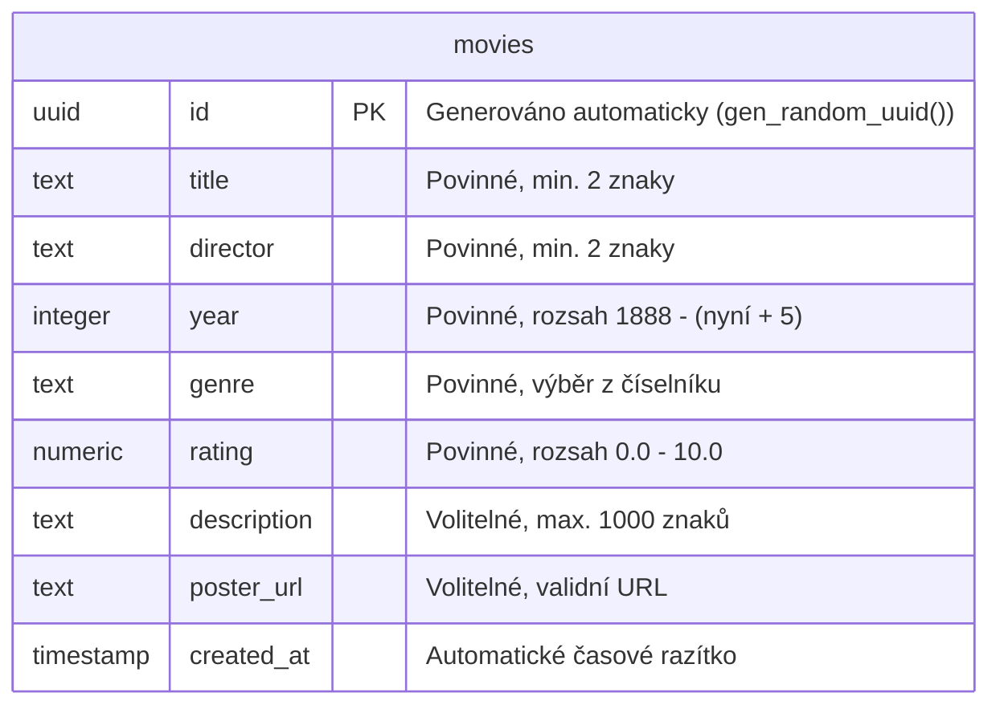
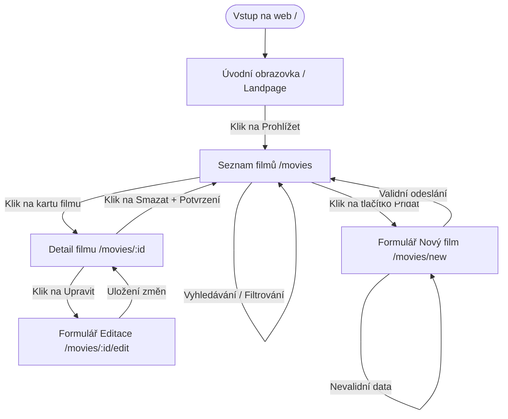

# CineVault – Filmová knihovna s integrací Supabase API
## Technická dokumentace a návrh webové aplikace

**Autoři:** Volodymyr Panovyk, Oleksandr Bukrieiev  
**Třída:** I3C  
**Předmět:** Tvorba webových aplikací  
**Vyučující:** Sergey Kuroedov  
**Školní rok:** 2025/2026  

---

## Obsah
1. **Úvod**
2. **Research (Průzkum trhu)**
3. **Analýza požadavků**
4. **Návrh funkcí systému (Role a User Stories)**
5. **Návrh řešení (Architektura, DB, User Flow)**
6. **Implementace**
7. **Porovnání návrhu a implementace**
8. **Závěr**

---

## 1. Úvod

V dnešní digitální éře čelí filmoví diváci paradoxu nadbytku. Fragmentace trhu streamovacích služeb (Netflix, HBO Max, Disney+, Apple TV+ a další) způsobuje, že je pro běžného uživatele obtížné udržet si přehled o filmech, které již zhlédl, nebo o těch, které se teprve chystá sledovat. Cílem tohoto projektu je vytvořit aplikaci **CineVault**, která slouží jako osobní, nezávislá a uživatelsky přívětivá filmová knihovna. 

Téma projektu bylo vybráno z důvodu vysoké praktické využitelnosti a potřeby demonstrovat moderní webové technologie v praxi. Aplikace poskytuje čisté rozhraní bez reklam, které uživateli umožňuje plnou kontrolu nad jeho daty.

**Cíl aplikace:** 
Hlavním cílem aplikace CineVault je poskytnout uživatelům nástroj pro efektivní správu (CRUD operace) jejich osobního katalogu filmů s možností vyhledávání, filtrování podle žánrů a hodnocení snímků na škále od 0.0 do 10.0.

**Cílová skupina:**
Cílovou skupinou jsou filmoví nadšenci (cinefilové), sběratelé fyzických či digitálních médií a běžní diváci, kteří chtějí mít přehledný digitální deník svých filmových zážitků bez nutnosti sdílení dat na sociálních sítích.

---

## 2. Research (Průzkum trhu)

Před zahájením návrhu a vývoje byla provedena analýza stávajících platforem, které řeší podobnou problematiku. Mezi nejvýznamnější zástupce patří IMDb, Letterboxd a Česko-Slovenská filmová databáze (ČSFD).

### IMDb (Internet Movie Database)
IMDb je největší světová databáze filmů a televizních pořadů. 
* **Výhody:** Obrovské množství dat, detailní biografie tvůrců, integrace s Amazonem, komplexní uživatelské seznamy.
* **Nevýhody:** Uživatelské rozhraní je přeplněné informacemi, obsahuje velké množství reklam a proces přidávání vlastních hodnocení či seznamů je zdlouhavý. Aplikace neumožňuje ukládat specifické osobní poznámky skryté před veřejností.

### Letterboxd
Letterboxd je sociální síť zaměřená výhradně na filmové fanoušky.
* **Výhody:** Vynikající moderní vizuální design, silný sociální aspekt (sdílení recenzí, diskuse), možnost vedení deníku sledování (Diary).
* **Nevýhody:** Platforma je primárně sociální sítí, což nemusí vyhovovat uživatelům hledajícím soukromí. Pokročilé statistiky a filtry jsou navíc zpoplatněny v rámci prémiového členství.

### ČSFD (Česko-Slovenská filmová databáze)
Lokální lídr v oblasti filmových databází v tuzemsku.
* **Výhody:** Rozsáhlá komunita v ČR/SR, kvalitní české a slovenské popisy filmů, hodnocení odrážející lokální vkus.
* **Nevýhody:** Uživatelské rozhraní je morálně zastaralé, web trpí agresivní reklamou a chybí možnost efektivní správy soukromé lokální knihovny s vlastními kategoriemi.

### Vymezení CineVault vůči konkurenci
CineVault se odlišuje tím, že se nesnaží být globální databází ani sociální sítí. Je koncipován jako **osobní trezor (Vault)**. Neobsahuje reklamy, načítá se okamžitě díky minimalizaci přenášených dat a poskytuje čisté, esteticky hodnotné rozhraní zaměřené pouze na uživatelovy vlastní záznamy.

---

## 3. Analýza požadavků

Na základě cílů aplikace a průzkumu konkurence byly definovány klíčové funkční a nefunkční požadavky na systém.

### Funkční požadavky
1. **Správa záznamů (CRUD):**
   - Vytvoření nového záznamu o filmu (název, režisér, rok vydání, žánr, hodnocení, popis, URL plakátu).
   - Zobrazení detailních informací o konkrétním filmu.
   - Editace jakéhokoliv existujícího záznamu.
   - Odstranění filmu z knihovny s potvrzovacím dialogem.
2. **Vyhledávání a filtrace:**
   - Fulltextové vyhledávání v reálném čase podle názvu filmu nebo jména režiséra.
   - Filtrování seznamu filmů podle žánrových kategorií.
3. **Validace dat:**
   - Validace vstupů na straně klienta před odesláním do databáze (kontrola rozsahů letopočtů, správnosti formátu URL u plakátů, limitů hodnocení).

### Nefunkční požadavky
1. **Responzivita (Mobile-First):** Rozhraní se musí adaptovat na různé šířky displejů (mobilní telefony, tablety, stolní počítače).
2. **Výkon a odezva:** Načítání a manipulace s daty musí probíhat asynchronně bez znatelných prodlev (odezva do 200 ms).
3. **Bezpečnost dat:** Využití spolehlivého cloudového úložiště s definovanými pravidly přístupu k tabulkám (Row Level Security).
4. **Estetická úroveň:** Použití moderních vizuálních prvků (glassmorphismus, gradienty, tmavý režim) pro zajištění prémiového uživatelského zážitku.

---

## 4. Návrh funkcí systému (User Stories a role)

Pro správný návrh uživatelského rozhraní a datových toků byly definovány uživatelské role a jejich potřeby formulované pomocí User Stories.

### Uživatelské role
1. **Návštěvník:** Uživatel, který si prohlíží úvodní stránku a seznamuje se s možnostmi systému.
2. **Registrovaný uživatel (Vlastník knihovny):** Uživatel s plným přístupem ke své knihovně (čtení, zápis, úpravy, mazání).
3. **Administrátor:** Správce systému, který může spravovat globální nastavení, např. definici podporovaných žánrů či moderování obsahu (v ideálním návrhu).

### Uživatelské scénáře (User Stories)

* **Uživatel (Čtení):**
  > *„Jako uživatel chci mít možnost zobrazit si přehledný seznam všech svých filmů v mřížce karet s plakáty, abych měl vizuální přehled o své sbírce.“*
  
* **Uživatel (Vyhledávání):**
  > *„Jako uživatel chci vyhledávat filmy zadáním jména režiséra nebo části názvu, abych rychle našel konkrétní film bez nutnosti procházet celý seznam.“*

* **Uživatel (Filtrace):**
  > *„Jako uživatel chci filtrovat filmy podle žánru (např. Sci-Fi), abych si mohl vybrat vhodný film na základě mé aktuální nálady.“*

* **Uživatel (Zápis s validací):**
  > *„Jako uživatel chci přidat nový film pomocí formuláře, který mě upozorní na chybějící nebo nesprávně zadaná data, abych předešel uložení neúplných informací.“*

* **Uživatel (Úprava):**
  > *„Jako uživatel chci mít možnost upravit hodnocení a popis u již uloženého filmu, protože se můj názor na film mohl po druhém zhlédnutí změnit.“*

* **Uživatel (Mazání):**
  > *„Jako uživatel chci smazat film z mé databáze, ale systém se mě musí nejprve zeptat na potvrzení, abych film nesmazal omylem jedním kliknutím.“*

### Dopad na uživatelské rozhraní a data
Z těchto příběhů vyplývá nutnost vytvořit:
- Dynamické vyhledávací pole reagující na změnu vstupu (`onChange`).
- Žánrový přepínač (dropdown), který okamžitě přepíše stav komponenty mřížky.
- Robustní formulář s vizuální indikací chyb (červené okraje polí, textové chybové hlášky).
- Modální nebo nativní potvrzovací dialogy před destruktivními akcemi (mazání).

---

## 5. Návrh řešení

### Architektura systému
Systém je navržen jako moderní jednostránková/vícestránková webová aplikace (SPA/MPA hybrid) na bázi frameworku **Next.js** využívajícího **App Router**. Pro ukládání dat slouží bezserverová databáze **Supabase** postavená na PostgreSQL. Communication layer zajišťuje asynchronní volání Supabase JS SDK.

### Databázový model (ERD)
Aplikace pracuje s relační tabulkou `movies`. Návrh schématu tabulky zohledňuje integritní omezení:



### Uživatelský průchod aplikací (User Flow)
Následující schéma popisuje, jak se uživatel pohybuje v rozhraní CineVault při správě filmů:



### Návrh uživatelského rozhraní (UI Mockup popis)
* **Hlavní přehled (`/movies`):** V horní části je fixní navigační lišta. Pod ní se nachází velký nadpis s počítadlem filmů. Střední část tvoří ovládací panel (vyhledávací pole zabírající 70 % šířky, žánrový select 30 %). Dolní část je tvořena responzivní mřížkou (grid) karet. Každá karta zobrazuje plakát, hodnocení v levém horním rohu, žánr v pravém horním rohu, název, režiséra a rychlá tlačítka (Detail, Smazat).
* **Detail filmu (`/movies/[id]`):** Dvou sloupcové rozložení na desktopu. Vlevo velký plakát filmu. Vpravo název filmu (písmo 2.5rem, gradient), meta data (rok, režisér, žánr, hodnocení se zlatou hvězdou), textový popis a akční tlačítka (Upravit, Smazat) v kontrastních barvách.

---

## 6. Implementace

Skutečně realizované řešení plně odpovídá navržené architektuře. Aplikace byla vyvinuta v čistém JavaScriptu za použití moderního Reactu v Next.js 15.

### Správa dat s využitím Supabase API
Propojení s PostgreSQL databází bylo realizováno pomocí inicializačního souboru [supabase.js](file:///C:/Users/panov/.gemini/antigravity/scratch/movie-library-app/lib/supabase.js). SQL doptávání probíhá na straně klienta (Client-side rendering) asynchronně:
- **Čtení dat:** Využívá metodu `supabase.from('movies').select('*')` seřazenou podle data vytvoření.
- **Zápis dat:** Provádí se asynchronní metodou `.insert([formData])`.
- **Aktualizace:** Vyhledá záznam podle ID a aktualizuje změněná pole pomocí `.update(formData).eq('id', id)`.
- **Mazání:** Volá `.delete().eq('id', id)`.

### Klientská validace (React Hook Form & Zod)
Formulář v komponentě [MovieForm.jsx](file:///C:/Users/panov/.gemini/antigravity/scratch/movie-library-app/components/MovieForm.jsx) využívá integraci `react-hook-form` a validátoru `Zod` pomocí resolveru. Validační schéma [schemas.js](file:///C:/Users/panov/.gemini/antigravity/scratch/movie-library-app/lib/schemas.js) vynucuje integritu dat:
```javascript
export const movieSchema = z.object({
  title: z.string().trim().min(2, { message: 'Název filmu musí mít alespoň 2 znaky' }),
  director: z.string().trim().min(2, { message: 'Jméno režiséra musí mít alespoň 2 znaky' }),
  year: z.coerce.number().int().min(1888).max(new Date().getFullYear() + 5),
  genre: z.string().trim().min(1, { message: 'Vyberte prosím žánr' }),
  rating: z.coerce.number().min(0).max(10),
  description: z.string().trim().optional().or(z.literal('')),
  poster_url: z.string().trim().url({ message: 'Neplatný formát URL pro plakát' }).optional().or(z.literal(''))
});
```
Metoda `z.coerce.number()` zajišťuje, že hodnoty získané z textových inputů HTML formuláře jsou před validací správně přetypovány na čísla. Pokud uživatel zadá neplatná data, formulář zablokuje odeslání a pod konkrétním polem vykreslí chybové hlášení s ikonou varování.

---

## 7. Porovnání návrhu a implementace

Mezi původním ideálním návrhem a finální implementací došlo k několika změnám. Tyto rozdíly jsou přirozenou součástí agilního vývoje softwaru.

### Odchylky od původního návrhu
1. **Absence uživatelské autentizace (přihlašování):** Původní ideální návrh počítal s registrací uživatelů tak, aby měl každý svou soukromou knihovnu. Z důvodu časového limitu a zachování jednoduchosti implementace pro účely školního projektu byla autentizace vynechána. Všechny CRUD operace tak aktuálně přistupují do jedné sdílené tabulky. Databáze je chráněna veřejnou RLS politikou, která povoluje operace všem anonymním uživatelům.
2. **Statické generování vs. Dynamický klient:** Ideální návrh počítal s čistým Server-Side Renderingem (SSR). Během implementace se však ukázalo, že pro potřeby vyhledávání v reálném čase, dynamického přepínání filtrů a potvrzovacích dialogů je výhodnější postavit CRUD stránky jako klientské komponenty (`'use client'`). To umožnilo plynulejší UX bez nutnosti neustálého znovunačítání celé stránky ze serveru.

### Kompromisy
* **Zadávání URL plakátů ručně:** V ideální aplikaci by měl být implementován vyhledávač, který po zadání názvu filmu sám vyhledá plakát přes externí API (např. TMDb). V implementaci musel být učiněn kompromis – uživatel zadává přímý odkaz na obrázek ručně, případně systém vykreslí elegantní náhradní vektorovou grafiku (fallback).

---

## 8. Závěr

Projekt **CineVault** úspěšně splnil všechny stanovené cíle a technické požadavky zadání. Byla vytvořena plně responzivní a moderní webová aplikace využívající Next.js App Router a databázové řešení Supabase API.

### Dosažené výsledky
- Plná implementace CRUD operací s okamžitou synchronizací s cloudovou PostgreSQL databází.
- Spolehlivý systém klientské validace, který zabraňuje zápisu nekonzistentních dat.
- Vysoce estetický a responzivní dark-mode design, který byl otestován na mobilních zařízeních i širokoúhlých monitorech.
- Úspěšné verzování projektu pomocí Git s logickou strukturou commitů a větvení.

### Limity projektu a budoucí rozšíření
Hlavním limitem současné verze je chybějící autentizace a autorizace uživatelů, kvůli čemuž je knihovna sdílená. 
V budoucnu by bylo vhodné aplikaci rozšířit o:
1. **Supabase Auth:** Integrace přihlašování přes e-mail nebo Google účet pro separaci dat jednotlivých uživatelů.
2. **TMDb API Integration:** Automatické doplňování informací o filmu (režisér, rok, popis, plakát) na základě zadání názvu, což by výrazně urychlilo proces přidávání filmů.
3. **Statistiky:** Přidání grafů a statistik (např. nejoblíbenější žánry, počet zhlédnutých filmů za rok) pro zvýšení gamifikace a uživatelské věrnosti.
